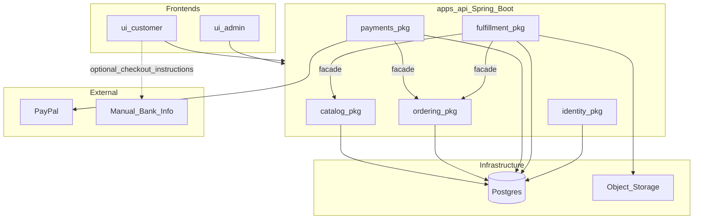

# MVP plan: digital IT store (admin + customer)

## At a glance

- **What:** Modular monolith (**Spring Boot**) + **Next.js** **ui-admin** / **ui-customer**; digital IT products; **PayPal** primary, **bank transfer** optional with admin confirmation.
- **Who:** **ADMIN** (back office), **CUSTOMER** (account + store), **anonymous** (browse + guest checkout)—only two persisted roles.
- **Design:** Visual system must match **[theme.html](file:///Users/husam/Documents/Development/me/sell-online/theme.html)** (tokens documented below).
- **Where:** Seller in **Jordan**; buyers global; payouts via PayPal → your bank per PayPal rules.

## Context

- Repository [sell-online](/Users/husam/Documents/Development/me/sell-online) includes **[theme.html](file:///Users/husam/Documents/Development/me/sell-online/theme.html)** as the **design reference**; application code under `apps/` and API implementation remain **greenfield** until build-out.
- You chose **digital products** (downloads/licenses), which simplifies shipping but requires **secure file delivery** and clear **refund/abuse** rules.
- You are in **Jordan** and want **online payment**; **bank transfer** is workable but is usually **manual** (you confirm payment, then fulfill)—it is not the same reliability or conversion as card/PayPal checkout.

## Product principles (MVP)

- **Value over velocity:** the MVP is **not** a stripped shell; it is the **smallest complete product** that serves real admin and customer workflows end-to-end with trustworthy payments and fulfillment.
- **Complete IA first:** **ui-admin** and **ui-customer** each ship with **all sections and pages** described below, including empty states, errors, loading, and confirmation feedback—not “add pages later.”
- **Two roles only:** application security exposes exactly **ROLE_ADMIN** and **ROLE_CUSTOMER**. Unauthenticated visitors may browse the storefront and complete **guest checkout** (order tied to email); they do not receive a role until they **register** and become **CUSTOMER**. **No** vendor, staff, or super-admin roles unless you explicitly reopen scope with an ADR.

## Design system (reference: `theme.html`)

**Source of truth:** [theme.html](file:///Users/husam/Documents/Development/me/sell-online/theme.html) at the **monorepo root** defines the **canonical look and feel** for both **ui-admin** and **ui-customer**. Implementations should **not** invent a separate brand; they **map** this reference into reusable tokens (CSS variables and/or Tailwind theme extension) so admin and store stay visually **one product**.

**Color tokens (from** `:root` **— use the same hex in app theme)**


| Token (CSS var) | Hex       | Usage                                                                                         |
| --------------- | --------- | --------------------------------------------------------------------------------------------- |
| `--yellow`      | `#F7C945` | Primary canvas / brand field (customer storefront body background; large marketing sections). |
| `--yellow-deep` | `#E8B62E` | Hover/deeper yellow when needed.                                                              |
| `--ink`         | `#1B1B1B` | Primary text, nav, dark buttons, stats strips, eyebrow pills (with yellow text on ink).       |
| `--ink-soft`    | `#3a3a3a` | Secondary text, muted labels.                                                                 |
| `--paper`       | `#FFFDF6` | Soft off-white surfaces inside illustrations/cards.                                           |
| `--card`        | `#ffffff` | Default card/sheet background on yellow.                                                      |
| `--pink`        | `#FF8FA3` | Accent chips, decorative tiles.                                                               |
| `--coral`       | `#FF7A59` | Highlights, scribble underlines, featured badges, avatar accents.                             |
| `--blue`        | `#6FA8FF` | Accent tiles, secondary highlights.                                                           |
| `--teal`        | `#2BC4A8` | Success/micro-accent dots, positive chips.                                                    |
| `--violet`      | `#8B7CF6` | Accent variety in grids.                                                                      |
| `--cream`       | `#FFE9A8` | Tags, FAQ open state, soft highlights.                                                        |
| `--soft`        | `#F1EEE3` | Neutral panels, integration tiles, sidebar fills.                                             |


**Typography**

- **Primary UI:** **DM Sans** (weights 400–900 as in reference); body default weight **500**; headings **900** with tight negative letter-spacing where matching the reference.
- **Accent / playful numerals:** **Caveat** for step numbers and hand-drawn-style labels (e.g. “~ 01”) where appropriate—**sparingly** in admin for personality without hurting density.

**Layout and density**

- **Max content width** `1180px` ~~with **~~28px** horizontal page padding on large screens (match `.wrap` / `nav.top` feel).
- **Admin** may use slightly denser tables but **same colors, type, buttons, and card language** as customer.

**Components to mirror (both apps)**

- **Buttons:** pill shape (`border-radius: 999px`), variants **dark** (ink fill, white text), **light** (white fill, ink text), **outline** (ink border, hover invert)—same hover transitions (~`0.15s`).
- **Cards:** white (or ink for emphasis) with **large radius** (`22px`–`28px`); optional **“hard shadow”** offset box (`~10px 10px 0 rgba(0,0,0,.12–.18)`) for featured panels—use consistently for primary CTAs and hero cards, not every list row.
- **Eyebrow / kicker labels:** small uppercase pill—**ink background**, **yellow text**, heavy weight (~800), letter-spaced—introduces sections (adapt copy for “IT solutions” context).
- **Section headings:** very large, **900** weight; optional **ink pill** highlight on key words (`.hi` pattern).
- **Stats / KPI strip:** **ink** background, **white** text, numbers in **yellow**—ideal for **admin dashboard** summary.
- **FAQ / collapsibles:** white card, **cream** background when open (reference `details.faq[open]`).
- **Footer / legal:** strong **ink** borders where the reference uses a **2px** top rule on foot-bottom—reuse for customer footer and admin chrome if applicable.

**Implementation notes**

- Add `**packages/design-tokens`** or a **shared Tailwind preset** consumed by **ui-admin** and **ui-customer**; optionally copy variable names 1:1 from `theme.html` (`--yellow`, `--ink`, …) into `:root` on both apps for easy diff against the reference.
- **Accessibility:** preserve WCAG contrast when placing **yellow** text on **yellow** fields—reference uses **ink** for primary reading text on yellow; keep body text **ink** on `--yellow` backgrounds.
- **Branding:** replace “Cortex” sample content with your **sell-online** product name and IT-solutions copy; **do not** change the underlying **color system** without updating `theme.html` first so the reference stays single-source.

## Recommended product split (your two sites)


| App             | Who uses it               | Purpose                                                                                                                                   |
| --------------- | ------------------------- | ----------------------------------------------------------------------------------------------------------------------------------------- |
| **ui-admin**    | **ADMIN** only            | Full back office: catalog, orders, payments visibility, fulfillment audit, store settings, legal copy, customer directory (read/support). |
| **ui-customer** | **Public** + **CUSTOMER** | Storefront, checkout, post-purchase flows, and **signed-in customer account** (orders, downloads, profile).                               |


**Monorepo** (one repo: **two Next.js frontends** + **one backend app** + shared packages) keeps API contracts, validation, and UI in sync. Alternative: two separate repos—more overhead for a solo MVP.

### Backend: modular monolith

Use **one deployable HTTP API** (`apps/api`)—a **modular monolith**: multiple **bounded contexts** in one process and one database, with **explicit module boundaries** so you can later extract a service (e.g. payments) without rewriting everything.

**Suggested modules (MVP)**

- **Catalog** — products, assets metadata, publish/draft; owns product tables and admin catalog use cases.
- **Ordering** — cart/session, checkout, order lifecycle (`**pending_payment`** → `**paid`** → `**fulfilled`**, plus** `**cancelled` / optional `**refunded`**); owns order/line tables.
- **Payments** — PayPal create/capture, **verified webhooks**, idempotency keys; owns `Payment` rows and maps provider events → order status (calls Ordering’s **application API**, not raw SQL in another module’s tables).
- **Fulfillment** — signed download URLs, audit log of deliveries; may depend on Catalog (asset keys) + Ordering (eligibility).
- **Identity** — **ADMIN** and **CUSTOMER** authentication only (registration, login, password reset, session/JWT); admin endpoints vs customer endpoints are separated by URL prefix and authority checks. **No additional roles.**

**Rules that keep it “modular”**

- **No cross-module imports of internals** (e.g. Catalog does not import `com.sellonline.payments.internal.PayPalClient`). Expose each module’s use cases via a small **public Java interface** / application service in an `**api`** or `**facade`** subpackage consumed by other modules only through that surface.
- **Cross-module coordination**: prefer **synchronous in-process calls** between facades for MVP; optional **domain events** (in-memory bus) if you want clearer decoupling without microservices complexity.
- **Data**: one Postgres; either **one schema with naming ownership** (prefix or team convention) or **separate Postgres schemas per module**—both are valid; avoid “every module reads every table” ad hoc.
- **HTTP surface:** **springdoc-openapi** on `apps/api` publishes OpenAPI; generate **TypeScript** clients into `packages/api-client` (or each app) with **openapi-generator** or **orval**—both UIs call **only** `apps/api` (Next.js BFF optional later).

**Backend stack (committed)**

**Spring Boot (Java)** is the chosen backend: **Gradle (Kotlin DSL)**, **Java 21** toolchain (21+ LTS; newer JDKs OK if Gradle and Spring support them), **Spring Boot 3.4.x**, **Spring Web**, **Spring Data JPA**, **Spring Validation**, **Spring Security**, **Flyway** + **PostgreSQL**, **Spring Modulith** (`spring-modulith-starter-core`, test starter for module verification), **springdoc-openapi** (Swagger UI + OpenAPI JSON), **AWS SDK v2 S3** (Cloudflare R2–compatible private objects), **PayPal** via official SDK or `RestClient` to PayPal REST, **Actuator** for health. Tests: **JUnit 5**, **Spring Boot Test**, **Testcontainers** (optional) for Postgres-flavored integration tests.

**Modular layout:** single Gradle module `apps/api` with base package `com.sellonline` and first-level packages `catalog`, `ordering`, `payments`, `fulfillment`, `identity`, `platform` (cross-cutting config). Each business package includes `package-info.java` with `@ApplicationModule` where appropriate; **no direct references** from one module’s `internal` packages to another’s—only to published facades/interfaces.




## Payments from Jordan (practical guidance)

**What “online payment only” usually means for buyers worldwide**

- **PayPal** is the most straightforward path for many Jordan-based individuals/small sellers to accept **international** payments without building a local card stack on day one. Buyers pay online; you receive to your PayPal balance and **withdraw to your Jordan bank** per PayPal’s rules and your account type. Fees apply; disputes/chargebacks are a real operational cost—document clear terms for digital goods.
- **Pure bank transfer (IBAN/SWIFT/Cliq, etc.)** is **not automated** in your app unless you integrate a bank-specific or PSP flow. Typical MVP: checkout creates an order in `**pending_payment`**, shows your bank details + unique reference code, and you **manually** mark the order paid in **ui-admin** after you see the money. Conversion is lower; support load is higher.
- **Stripe** as a Jordan-resident without a foreign entity is often **not** the default path; people sometimes use a **registered foreign company** to access Stripe—higher setup/compliance cost than MVP needs.
- **Local/regional PSPs and wallets** (e.g. card acquirers operating in Jordan, MENA wallets) can be added **after** you have traction; they help local buyers but are a second integration wave.

**Recommendation for MVP:** implement **PayPal** as the primary online method, and **bank transfer** as an optional path with explicit **admin** confirmation in **ui-admin** (same value bar: full customer + admin pages for that path, not a half-built flow).

## Roles and access (authoritative)


| Authority     | Used on          | Capabilities (summary)                                                                                                               |
| ------------- | ---------------- | ------------------------------------------------------------------------------------------------------------------------------------ |
| **Anonymous** | ui-customer only | Browse published catalog, manage cart, **guest checkout** (email on order), read legal pages; **cannot** access ui-admin.            |
| **CUSTOMER**  | ui-customer      | Everything anonymous can do, plus **account**: order history, downloads, profile/password, signed-in checkout defaults.              |
| **ADMIN**     | ui-admin only    | Full back office per IA below; **must not** use customer-only “impersonation” unless you add it later (out of scope—two roles only). |


API rule: path prefix `**/api/v1/admin/`** requires **ADMIN**; `**/api/v1/customer/`** requires **CUSTOMER** when authenticated; `**/api/v1/store/`** covers public catalog read plus cart/checkout as designed. (Exact prefix naming is an implementation detail—keep the separation strict.)

## ui-admin — full page map and actions (ADMIN only)

All routes require **ADMIN** unless noted as public auth (login only).

**1. Authentication**

- `**/login`** — Sign in with email + password (or chosen method). **Actions:** submit credentials, show validation errors, link to forgot password.
- `**/forgot-password`** — Request reset token. **Actions:** submit email, confirm “check your inbox.”
- `**/reset-password`** — Complete reset from token. **Actions:** set new password, invalid/expired token state.
- `**/logout`** — End session (POST or server action). **Actions:** confirm logout optional.

**2. Dashboard (**`/`**)**

- **Actions:** view KPI cards (revenue range, orders count, pending bank payments, failed/captured payments), shortcuts to Orders and Products, recent activity list (last N orders).

**3. Catalog — products**

- `**/products`** — List all products. **Actions:** search/sort/filter by status (draft/published/archived), paginate, **Create product**, open row.
- `**/products/new`** — Create. **Actions:** title, slug, description (rich text optional), price, currency, upload/replace **digital asset**, validate file type/size, **Save draft**, **Publish**, cancel.
- `**/products/[id]`** — Edit. **Actions:** same fields, **Unpublish**, **Publish**, **Archive/Delete** (with confirm), **Duplicate** (optional but valuable), **Preview on storefront** (opens ui-customer PDP in new tab), replace asset with version note.

**4. Orders**

- `**/orders`** — List. **Actions:** search by order id / customer email, filter by status and date range, sort, **Export CSV**, open detail.
- `**/orders/[id]`** — Detail. **Actions:** view lines, prices, customer email, payment method chosen; timeline of status + payment events + fulfillment events; **Mark as paid** (bank-transfer path); **Cancel order** (policy); **Add internal note**; **Resend order email**; **Regenerate download links** (if business rules allow and rate-limited); link to related payment records.

**5. Payments (read-centric)**

- `**/payments`** (or embedded filters on Orders if you prefer one less nav item—document choice) — List payment records. **Actions:** filter by provider/status, open detail read-only with raw correlation ids for support (mask secrets).

**6. Fulfillment / audit**

- `**/fulfillment`** or `**/orders/[id]/downloads`** — Per-product download audit. **Actions:** list download events (timestamp, IP optional, user agent optional), export for disputes.

**7. Customers (support directory)**

- `**/customers`** — List **CUSTOMER** accounts (if registration exists). **Actions:** search, open profile.
- `**/customers/[id]`** — **Actions:** view profile, list their orders (links), read-only notes (optional internal note on customer—use carefully for GDPR).

**8. Store settings**

- `**/settings/general`** — Shop display name, default currency, support contact email, storefront hero copy (optional). **Actions:** save, validation.
- `**/settings/payments`** — PayPal environment indicator (sandbox/live read-only label), reminder to configure secrets (no secret display). **Actions:** save non-secret toggles only if applicable.
- `**/settings/bank-transfer`** — Enable/disable bank method, bank details copy blocks, reference format hint. **Actions:** save, preview how customer sees it.
- `**/settings/legal`** — Terms, privacy, refund policy body (markdown or rich editor). **Actions:** edit, preview, save, **Publish** (what customers see).

**9. Admin account**

- `**/account/profile`** — **Actions:** change password, update email (if allowed), sign out other sessions (optional), MFA later = explicit scope creep—omit unless you want it in MVP list.

**10. System / errors**

- `**/403`**,** `**/404` — Clear messaging. **Actions:** navigate home.

## ui-customer — full page map and actions (PUBLIC + CUSTOMER)

**1. Authentication (CUSTOMER)**

- `**/register`** — **Actions:** create account (email, password, name), accept terms checkbox, handle duplicate email.
- `**/login`** — **Actions:** sign in, link to register and forgot password.
- `**/forgot-password`**,** `**/reset-password` — Same pattern as admin but customer-branded.
- `**/logout`** — End session (same pattern as admin).

**2. Storefront**

- `**/`** — Home. **Actions:** view featured products, navigate to catalog, trust badges, footer legal links.

**3. Catalog**

- `**/products`** — Browse. **Actions:** search, filters (e.g. category if you add categories), sort, pagination.

**4. Product detail (PDP)**

- `**/products/[slug]`** — **Actions:** read full description, see price, **Add to cart** (quantity), **Buy now** shortcut to checkout (optional), out-of-stock / unpublished = 404.

**5. Cart**

- `**/cart`** — **Actions:** change quantities, remove item, see totals, **Proceed to checkout**, continue shopping, empty-cart state.

**6. Checkout**

- `**/checkout`** — **Actions:** collect email (required for guest), name; if **CUSTOMER** logged in, prefill; accept terms + refund policy links; choose **PayPal** and/or **Bank transfer** if enabled; place order → order enters `**pending_payment`** or redirect to PayPal.
- `**/checkout/bank-instructions`** — Shown when bank selected. **Actions:** copy account details, copy **payment reference**, read “what happens next,” link to support.

**7. Payment return**

- `**/checkout/success`** — PayPal success / generic paid confirmation. **Actions:** show order summary, **Go to downloads**, resend email CTA (rate-limited API).
- `**/checkout/cancelled`** — PayPal cancelled. **Actions:** return to cart or retry checkout.

**8. Order confirmation (guest-friendly)**

- `**/orders/confirmation`** — Tokenized link from email or short-lived session. **Actions:** view order state, payment pending vs paid, download links when eligible.

**9. Customer account (requires CUSTOMER)**

- `**/account`** — Overview. **Actions:** quick links to orders and downloads.
- `**/account/orders`** — **Actions:** list orders, filter by status, open order.
- `**/account/orders/[id]`** — **Actions:** view detail, download files (signed URLs), **Request email again** for that order.
- `**/account/downloads`** — Aggregate downloadable entitlements. **Actions:** download each file, see expiry hint if you show one.
- `**/account/profile`** — **Actions:** update name, change password, delete account (optional with confirm + email round-trip—include if you value trust).

**10. Legal (PUBLIC)**

- `**/legal/terms`**,** `**/legal/privacy`, `**/legal/refunds`** — **Actions:** read (content sourced from admin-published settings).

**11. Errors**

- `**/403`**,** `**/404`, `**/500`** — Customer-appropriate copy and recovery links.

## MVP scope (backend alignment)

The backend **Spring Boot** modules (**Catalog, Ordering, Payments, Fulfillment, Identity, platform**) implement every **API** implied by the two UI maps above, including audit logs, idempotent webhooks, and rate limits on sensitive actions (resend email, regenerate link, login).

### Backend / data model (by module)

- **Catalog owns:** **Product**, **ProductAsset** (storage key, filename, checksum optional).
- **Ordering owns:** **Order**, **OrderLine** and status transitions via its application service (invoked by Payments / admin actions). Canonical order statuses (extend only via ADR): `**pending_payment`** (created, not paid), `**paid`**,** `**fulfilled`, `**cancelled`**; optional `**refunded**` if you support refunds in MVP.
- **Payments owns:** **Payment** (provider, intent or capture id, status, idempotency key, optional raw webhook payload for audit).
- **Fulfillment owns:** delivery audit / entitlement rows if you split them from Order (optional in MVP: append-only **DownloadEvent**).
- **Identity owns:** **User** records (or split **AdminUser** / **CustomerUser**—document in ADR), credentials, password-reset tokens, **role** ∈ {`ADMIN`, `CUSTOMER`} only.
- **Payments module:** **Idempotent webhooks** from PayPal (verify signatures per PayPal docs); never update Order rows directly without going through Ordering’s public API.

### Explicitly out of scope (not “MVP shortcuts”)

- Multi-vendor marketplace, advanced tax/VAT engine, subscriptions, affiliate codes, native mobile apps, full multi-locale i18n, extra roles beyond **ADMIN** / **CUSTOMER**.

These items are excluded to protect focus; they are **not** an excuse to omit pages or actions already listed in the **ui-admin** and **ui-customer** maps.

## Suggested technical stack

- **Frontends:** Next.js (App Router) for **ui-admin** and **ui-customer**; **shared visual system** from `**theme.html`** via tokens/preset (see Design system); consume API via OpenAPI-generated TypeScript client against `**apps/api` base URL**.
- **Backend:** `**apps/api`** — **Spring Boot** modular monolith (layout above); optional `**apps/api/package.json`** npm scripts delegating to `./gradlew` so Turborepo can orchestrate `build` if desired.
- **Monorepo:** Turborepo + optional `packages/api-client` (generated from OpenAPI), optional `packages/ui`; **no** Prisma—schema lives in **Flyway** under `apps/api`.
- **Database:** PostgreSQL (e.g. Neon) — single instance; schemas or naming conventions per module as above.
- **File storage:** S3-compatible bucket (e.g. Cloudflare R2) with **private** objects; **Fulfillment** (or Catalog application service) issues **short-lived signed URLs** after payment.
- **Hosting:** Vercel for both UIs (two projects, same repo, different `rootDirectory`); `**apps/api`** as a **JVM container** or **JAR** on Fly.io, Railway, Render, or any VPS—webhooks need a stable public URL. Configure **CORS** for the two frontend origins only.
- **Email:** Resend/Postmark for “order confirmed” + download instructions (triggered from Ordering/Fulfillment use case after `paid`).

## Security checklist (digital goods)

- **ui-admin** is never anonymously usable beyond `/login` (and password-reset flow if self-hosted).
- **Exactly two roles** in authorization rules: **ADMIN** and **CUSTOMER**; anonymous is unauthenticated only—do not overload “customer” as a third persisted role.
- **Webhook verification** mandatory; never trust client-only “payment succeeded.”
- **Rate-limit** checkout, login, password reset, **resend email**, and **regenerate download link** endpoints.
- **Log** fulfillment events (who downloaded, when) for dispute handling.

## Operational checklist (Jordan)

- **Business vs personal:** PayPal and banks often ask for **identity and sometimes business documentation** as volume grows. Plan for a simple trade name / freelancer registration path if required by your payout method.
- **Pricing:** pick one **display currency** for MVP; PayPal can still settle in a supported balance currency—confirm against your account settings.
- **Accounting:** export orders monthly (CSV) from admin—add a report export early if you care about taxes.

## Delivery milestones (value-oriented phases)

1. **Foundation:** monorepo, **design tokens from** `theme.html`, `apps/api` modular skeleton, Postgres + Flyway, **Identity** with **ADMIN** + **CUSTOMER** + anonymous rules, OpenAPI published, health checks.
2. **Catalog value:** full **admin** catalog CRUD + full **customer** home/catalog/PDP (including empty/error states) wired to real APIs.
3. **Commerce value:** cart + checkout (PayPal + optional bank path) + return/cancel + confirmation + **admin** orders list/detail with operational actions.
4. **Fulfillment trust:** signed downloads, email flows, download audit, **customer** account area (orders, downloads, profile) end-to-end.
5. **Polish:** settings + legal CMS from admin to customer pages, CSV exports, automated tests on webhooks and RBAC, observability (logs/metrics/traces) as needed.

## Open decisions (product, not shortcuts)

- **Currency strategy:** single display/settlement currency vs multi-currency display—choose based on buyer geography and PayPal settlement, not calendar pressure.
- **Guest vs account-only checkout:** plan supports **guest** + **registered CUSTOMER**; if you ever drop guest checkout, that is an explicit product change (conversion vs account coercion).

## Target repository layout (when implemented)

```text
sell-online/
  theme.html                 # design reference (keep in sync with tokens)
  package.json               # Turborepo root; workspaces = ui-admin, ui-customer
  turbo.json
  apps/
    api/                     # Spring Boot modular monolith (Gradle)
    ui-admin/                # Next.js (ADMIN)
    ui-customer/             # Next.js (PUBLIC + CUSTOMER)
  packages/
    design-tokens/           # or tailwind preset: colors, fonts, radii from theme.html
    api-client/              # generated from OpenAPI (optional shared package)
```

## Configuration and secrets (checklist)

Document in `**.env.example**` (never commit real secrets): Postgres URL; PayPal client id/secret and webhook id; S3/R2 bucket + credentials; JWT secret or session signing key; SMTP/API key for transactional email; `NEXT_PUBLIC_API_URL` for each frontend; `CORS_ALLOWED_ORIGINS` on the API.

## Definition of Done (MVP)

- All **ui-admin** and **ui-customer** routes in this plan exist with **loading, empty, error, and success** states.
- **RBAC:** only **ADMIN** / **CUSTOMER** / anonymous behaviors as specified; integration tests for critical paths.
- **Payments:** PayPal happy path + webhook idempotency + cancel path; bank path matches admin/customer pages if enabled.
- **Fulfillment:** paid orders receive **expiring** download links; **DownloadEvent** (or equivalent) audit exists.
- **Design:** both UIs pass visual review against `**theme.html`** tokens (not pixel-perfect clone of marketing page layout, but **same palette, type, buttons, card language**).
- **Runbooks:** webhook URL, deploy steps, and **CSV export** path documented in root README.

## Risks and mitigations


| Risk                                           | Mitigation                                                                                                         |
| ---------------------------------------------- | ------------------------------------------------------------------------------------------------------------------ |
| PayPal disputes / chargebacks on digital goods | Clear refund terms; email + audit trail; conservative “regenerate link” policy.                                    |
| Bank transfer reconciliation errors            | Unique payment reference per order; admin **internal notes**; CSV export.                                          |
| Signed URL leakage or long TTL                 | Short TTL, one-time or rate-limited regeneration, private bucket, no public asset URLs.                            |
| GDPR / privacy (EU buyers)                     | Privacy policy content in admin legal settings; data minimization on customer notes; document retention in README. |


## Plan document

- **Living plan:** this file is the single product+tech spec for the MVP; change it when scope shifts, then implement to match.
- **Execution:** implementation work belongs in the repo under `apps/` and `packages/` as above once development starts (outside plan-only mode).

